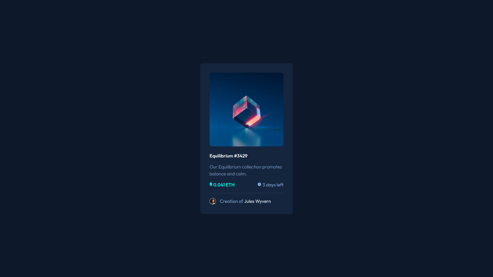
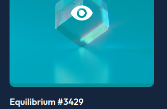

# Frontend Mentor - NFT preview card component solution

This is a solution to the [NFT preview card component challenge on Frontend Mentor](https://www.frontendmentor.io/challenges/nft-preview-card-component-SbdUL_w0U). Frontend Mentor challenges help you improve your coding skills by building realistic projects.

## Table of contents

- [Overview](#overview)
    - [The challenge](#the-challenge)
    - [Screenshot](#screenshot)
    - [Links](#links)
- [My process](#my-process)
    - [Built with](#built-with)
    - [What I learned](#what-i-learned)
    - [Continued development](#continued-development)
    - [Useful resources](#useful-resources)
- [Author](#author)

## Overview

### The challenge

Users should be able to:

- View the optimal layout depending on their device's screen size
- See hover states for interactive elements

### Screenshot



### Links

- Solution URL: [https://github.com/R3B3-888/nft-preview-card-component](https://github.com/R3B3-888/nft-preview-card-component)
- Live Site URL: [https://r3b3-888.github.io/nft-preview-card-component/](https://r3b3-888.github.io/nft-preview-card-component/)

## My process

### Built with

- Semantic HTML5 markup
- CSS custom properties
- Flexbox

### What I learned

I learned about hover on overlay and image:

```css
.overlay {
    position: absolute;
    top: 0;
    bottom: 0;
    right: 0;
    left: 0;
    width: 100%;
    height: 100%;
    opacity: 0;
    background-color: var(--cyan);
    border-radius: 10px;
}

.eye {
    position: absolute;
    top: 50%;
    left: 50%;
    transform: translate(-50%, -50%);
    display: none;
}

.main-img:hover .overlay {
    cursor: pointer;
    opacity: 0.5;
}

.main-img:hover .overlay + .eye {
    display: block;
}
```


### Continued development

Redo the overlay stuff because it's not perfect.



### Useful resources

- [Nakoyawilson repository](https://github.com/nakoyawilson/nft-preview-card-component) - This helped me for the overlay.

## Author

- Website - [Alexis](https://r3b3.github.io)
- Frontend Mentor - [@R3B3-888](https://www.frontendmentor.io/profile/R3B3-888)
